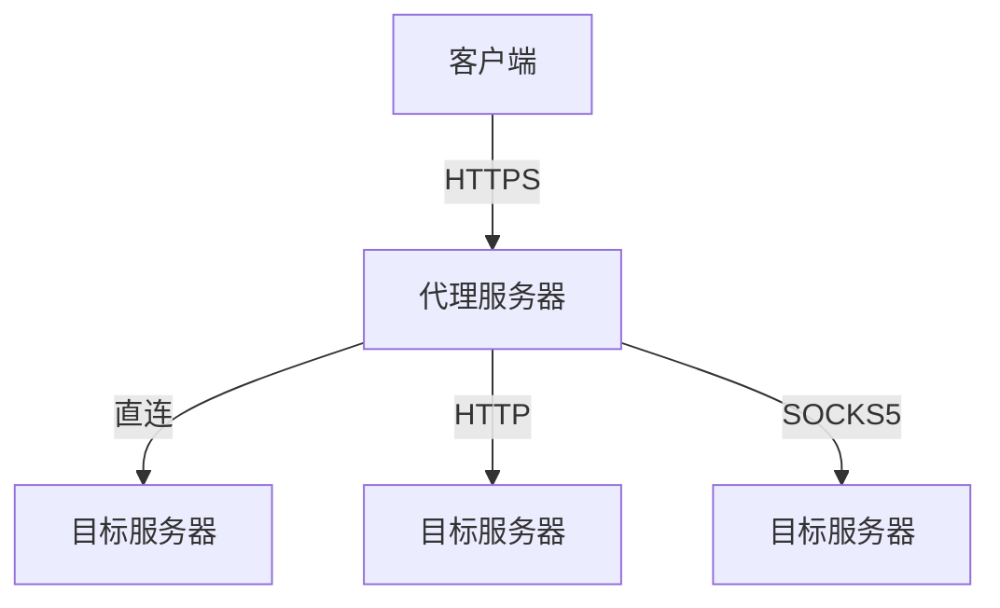
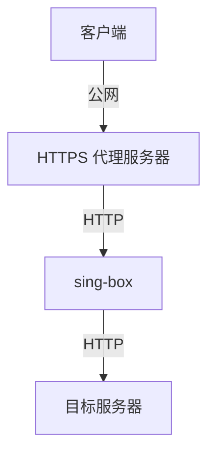

# https-proxy

> 轻量级的 HTTPS 代理服务器

## 功能

- 支持 HTTPS 代理作为流量入口
- 支持 直连、HTTP 代理、SOCKS5 代理作为流量出口

```mermaid
graph TD
    A[客户端] -->|HTTPS| B[代理服务器]
    B -->|直连| C[目标服务器]
    B -->|HTTP| D[目标服务器]
    B -->|SOCKS5| E[目标服务器]
```

## 使用场景

在公网服务器上部署带有 Basic Auth 的 HTTPS 代理服务器，作为安全的流量入口，然后连接到后继代理服务器(如 sing-box)，实现安全的代理链路。

```mermaid
graph TD
    A[客户端] -->|公网| B[HTTPS 代理服务器]
    B -->|HTTP| C[sing-box]
    C -->|HTTP| D[目标服务器]
```