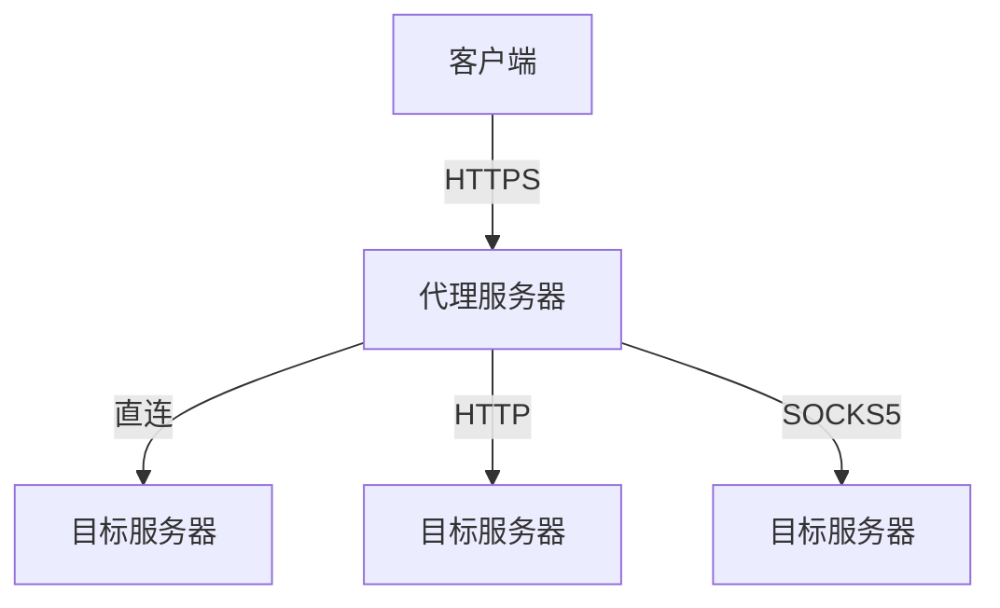

# https-proxy

> 轻量级的 HTTPS 代理服务器

- 提供 HTTPS 代理作为流量入口
- 支持 直连、HTTP 代理、SOCKS5 代理作为流量出口

```mermaid
graph TD
    A[客户端] -->|HTTPS| B[代理服务器]
    B -->|直连| C[目标服务器]
    B -->|HTTP| D[目标服务器]
    B -->|SOCKS5| E[目标服务器]
```
